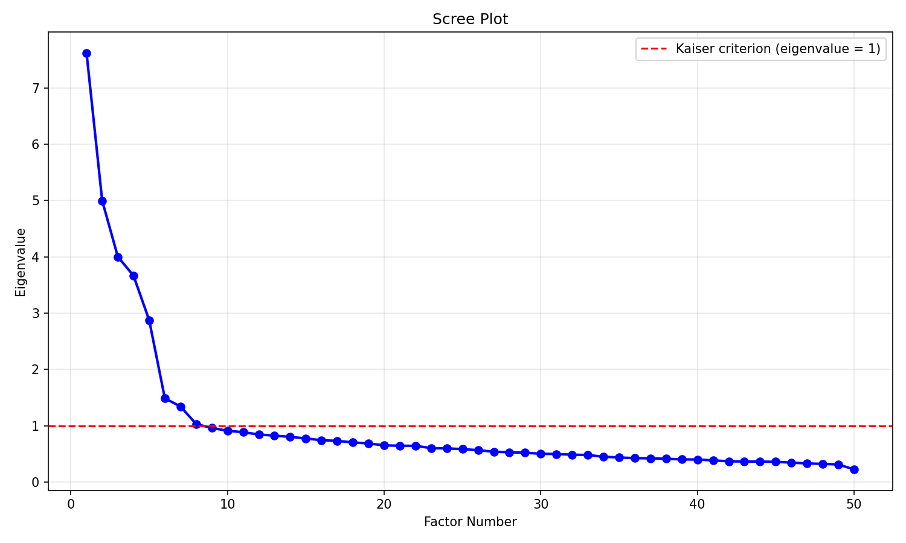
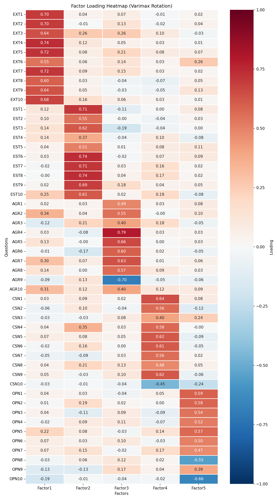

# IPIP Big Five Personality Analyzer

## Project Overview

A machine learning web application that uses **Factor Analysis** — an unsupervised dimensionality reduction technique from Applied Machine Learning — to extract the Big Five personality dimensions (OCEAN) from 50 survey items. The system fits a 5-factor model on 874K+ real survey responses using MINRES extraction with Varimax rotation, then serves predictions through a FastAPI backend and an interactive Streamlit UI where users answer 50 questions and receive a radar chart personality profile.

## Dataset

**IPIP-50** (International Personality Item Pool) from [Kaggle — Big Five Personality Test](https://www.kaggle.com/datasets/tunguz/big-five-personality-test).

- **1,015,341 raw responses** collected via an online questionnaire
- **50 items**: 10 questions per personality trait (EXT, EST, AGR, CSN, OPN)
- Responses on a 1–5 Likert scale (Strongly Disagree → Strongly Agree)
- **28 reverse-scored items** are recoded as `6 - original_score` before analysis
- After cleaning (dropping incomplete/invalid rows): **874,434 usable responses**

## Methodology

### What Factor Analysis Does Here

Factor Analysis (FA) is a dimensionality reduction technique that identifies latent (unobserved) variables — called **factors** — that explain the correlations among observed variables. In this project, 50 survey items are reduced to 5 latent factors, each representing a personality dimension.

Unlike PCA (which maximizes variance), FA specifically models the **shared variance** (communality) among variables while separating out unique variance and measurement error. This makes FA more appropriate for psychological constructs where we assume latent traits cause the observed responses.

The extraction method used is **MINRES** (Minimum Residual), which minimizes the sum of squared off-diagonal residuals in the correlation matrix.

### Why Varimax Rotation

Raw factor loadings are mathematically valid but hard to interpret — items often load on multiple factors. **Varimax rotation** is an orthogonal rotation that maximizes the variance of squared loadings within each factor, pushing each item to load heavily on one factor and near-zero on others. This produces a **simple structure** where each factor cleanly maps to one personality trait.

Varimax is the standard rotation for Big Five research because the five personality dimensions are theoretically independent (orthogonal).

### Kaiser Criterion

The **Kaiser criterion** (eigenvalue > 1) was used to determine the number of meaningful factors. Eigenvalues were computed via PCA on the standardized correlation matrix:

- **8 factors** had eigenvalues above 1
- However, **5 factors** were retained based on Big Five personality theory and the scree plot elbow
- The 5-factor solution explains approximately **40.6%** of total variance, which is consistent with published Big Five FA studies

### Factor-to-Big Five Mapping

The varimax-rotated factor loadings confirm clean alignment with the Big Five:

| Factor | Trait | Column Prefix | Description |
|--------|-------|---------------|-------------|
| Factor 1 | Extraversion | EXT1–EXT10 | Sociability, assertiveness, positive emotions |
| Factor 2 | Neuroticism | EST1–EST10 | Emotional instability, anxiety, moodiness |
| Factor 3 | Agreeableness | AGR1–AGR10 | Cooperation, trust, empathy |
| Factor 4 | Conscientiousness | CSN1–CSN10 | Organization, dependability, self-discipline |
| Factor 5 | Openness | OPN1–OPN10 | Creativity, curiosity, openness to experience |

## Results

### Scree Plot



### Factor Loading Heatmap



### Variance Explained

| Factor | SS Loadings | Proportion Variance | Cumulative Variance |
|--------|-------------|--------------------|--------------------|
| Factor 1 | 5.11 | 10.2% | 10.2% |
| Factor 2 | 4.61 | 9.2% | 19.4% |
| Factor 3 | 3.88 | 7.8% | 27.2% |
| Factor 4 | 3.39 | 6.8% | 34.0% |
| Factor 5 | 3.29 | 6.6% | 40.6% |

## How to Run

### Without Docker

```bash
# 1. Install dependencies
pip install -r requirements.txt

# 2. Place dataset at data/raw/data-final.csv

# 3. Run Factor Analysis pipeline (generates plots + scores)
python -m src.factor_analysis

# 4. Start FastAPI backend (port 8000)
python api/main.py &

# 5. Start Streamlit frontend (port 8501)
streamlit run app/streamlit_app.py --server.port 8501
```

Open http://localhost:8501 in your browser.

### With Docker

```bash
# Build the image
docker build -t bigfive-analyzer .

# Run with data mounted as volume
docker run -v $(pwd)/data:/app/data -p 8000:8000 -p 8501:8501 bigfive-analyzer
```

The dataset is excluded from the Docker image (too large) and must be mounted at runtime via the `-v` flag.

## Tech Stack

| Component | Technology |
|-----------|-----------|
| Language | Python 3.10+ |
| Factor Analysis | factor_analyzer (MINRES + Varimax) |
| Data Processing | pandas, numpy |
| Standardization | scikit-learn StandardScaler |
| Visualization | matplotlib, seaborn |
| Backend API | FastAPI + uvicorn |
| Frontend UI | Streamlit |
| Containerization | Docker |
